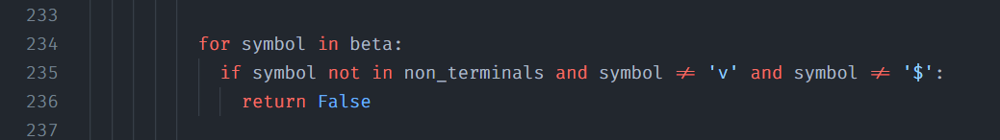
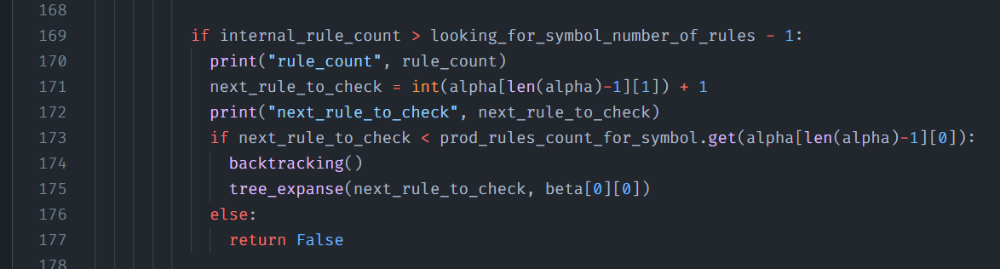

# top-down-backtrack-parsing
Análise sintática descendente com retorno

# Histórico

## 20/11/2021

### Solução para resolver erro em algumas cadeias quie são reconhecidas, mas ainda resta elementos não vazios em beta

Na cadeia '(12-6/5' havia um erro no algoritmo.

Foi adicionado uma verificação depois de ter um generated_w igual a w, que, antes de tentar expandir os simbolos não terminais na tentativa de obter apenas cadeias vazias, verifica se em beta há algum terminal diferente de 'v' e '$'. Caso exista, não será necessário expandir, porque já sabemos que o restante não é vazio.

### Solução para passar a aceitar números negativos

A cadeia '-1+2', por exemplo, era marcada como False, porque F0 era testado, gerava um terminal em beta[0]: '(', não era compatível com w[symbols_count]; então expandia para F1, que gerava um não terminal, que, então, era expandido para N0 até N8. Como N só gera símbolos terminais em beta[0], ao testar todas as regras, nenhuma era compatível e caía na condição de testar uma regra de número maior do que existe para aquele símbolo não terminal e retornava False.

Com a implementação de agora, quando cai nessa mesma condição, faz um backtracking, verifica o número da regra que havia sido testada, caso seja possível expandi-la, o faz.
Só vai retornar False quando, de fato, não for possível expandir ao máximo até a **penultima regra testada**.

## 19/11/2021
### Solução só aceitar w se (caso) o que sobrou em beta gere apenas vazio

Caso tenha restado alguma coisa em beta, expandir até obter apenas vazio

Caso todas as regras daquele símbolo sendo analisado (looking_for_symbol) tenham sido testadas e nenhuma delas tenha retornado vazio, então a cadeia gerada pelo que restou em beta não deverá ser aceita como parte da linguagem

