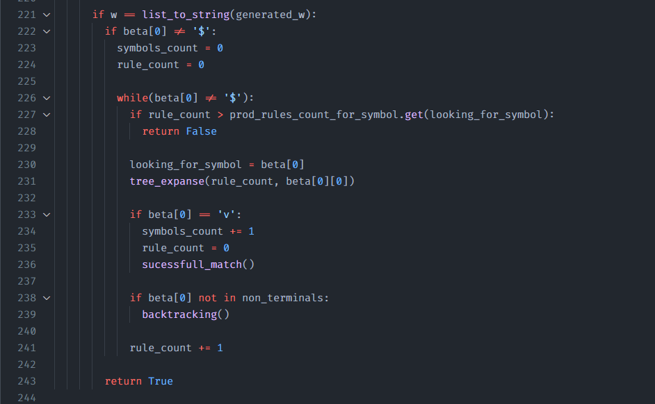

# top-down-backtrack-parsing
Análise sintática descendente com retorno

# Histórico

## 19/11/2021
### Solução só aceitar w se (caso) o que sobrou em beta gere apenas vazio

Caso tenha restado alguma coisa em beta, expandir até obter apenas vazio

Caso todas as regras daquele símbolo sendo analisado (looking_for_symbol) tenham sido testadas e nenhuma delas tenha retornado vazio, então a cadeia gerada pelo que restou em beta não deverá ser aceita como parte da linguagem

